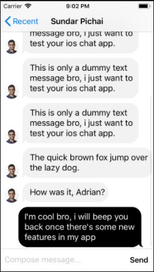
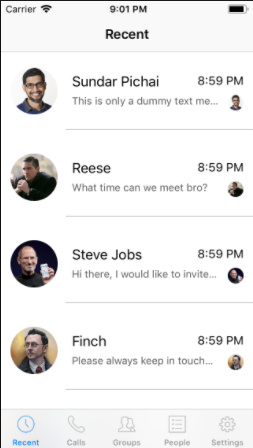

# MobDevTestPrototype/convoX

Mobile Developer Test Prototype for chat application

## Preview Image

<p align="center"> 


</p>

## Getting Started

These repo will get you a copy of the project up and running on your local machine for development and testing purposes.

### Prerequisites

What things you need to install the software and how to install them

```
XCode with good knowledge in Objective - C
```

## Built With

* [FMDB SQlite](https://github.com/ccgus/fmdb) - This is an Objective-C wrapper around SQLite: http://sqlite.org/

## Versioning

- ConvoX v.1.0

## Author

* [Adrian Millena](https://www.facebook.com/drey01819) 

## Acknowledgments

* C O N V O ~ X - PH

